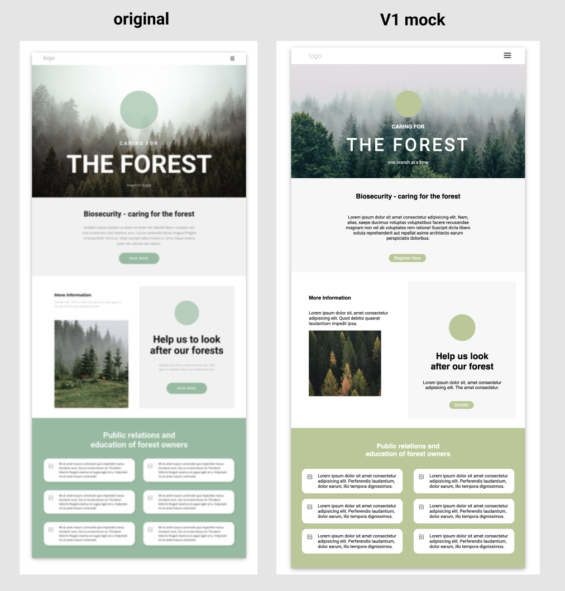

# Forest Mock Website 

#### Hello! This repo is part of a multi-part mock website series in which I try to simulate existing websites to brush up on my UX/UII design skills. These will mostly be done in basic HTML, CSS, Figma Wireframes, and a touch of JS if needed. I will also be incorporating tools I'm learning from Kevin Powell's CSS Demystified course and Nashville Software School's Front-End and UX/UI Product courses. Enjoy!

## Relevant Links
- [Deployed Site : Netlify](https://forest-mock-series.netlify.app/)
- [Wireframes: Figma](https://www.figma.com/file/W5NvQ2jmDbTg8aAj87NwAN/Forest?node-id=0%3A1)
- [Project Board: Github](https://github.com/danicrosby/forest-mock-series)

### Project Screenshot

## Contributors
- [Dani Crosby](https://github.com/danicrosby)

#### Photo & Design Credits: 
- [Filip Zrnzević: Banner Image](https://unsplash.com/@filipz)
- [Federico Bottos: Content Photo 1](https://unsplash.com/@landscapeplaces)
